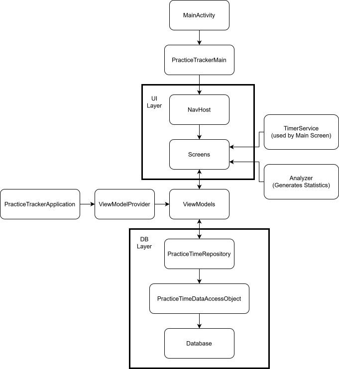

# Practice Tracker

This repository contains an Android-App written in Kotlin with Jetpack Compose. It can be used to track practice sessions (e.g. for practicing a musical instrument) and stores the practice times inside an internal database which is managed with the Room persistence library. The data base can be saved as and restored from an sqlite-db file.

The stored data is evaluated by the application and statistics are generated from it. There is a simple UI with three areas:

- Start page where the user can start a practice timer
- Page for entering a practice time manually
- Pages with statistics generated from the db-data

## Architecture ##

The architecture follows the Model-View-ViewModel approach common for Compose-Apps and looks like this:

## Requirements ##

The minimum OS-Version to run the App is Android 13.0 (API 33) and it supports newer versions up to Android 16. To build it you need JDK >= 17, SDK 37 and a build environment supporting gradle plugin v.9.2.1 (Android Studio Panda 4 or Quail 1). Also Kotlin >= 2.0.0 is required.

*Note: Currently the app needs androidx.media:media:1.7.1 and is incompatible with newer versions of this lib because the MediaSessionCompat used by the TimerService is deprecated in v1.8*

## Disclaimers and license ##

Disclaimer: Google Gemnini was used during the implementation of this project.

This project is licensed under the MIT License. It relies on third-party libraries (like AndroidX and JUnit) which are governed by their respective Apache 2.0 and EPL licenses.
